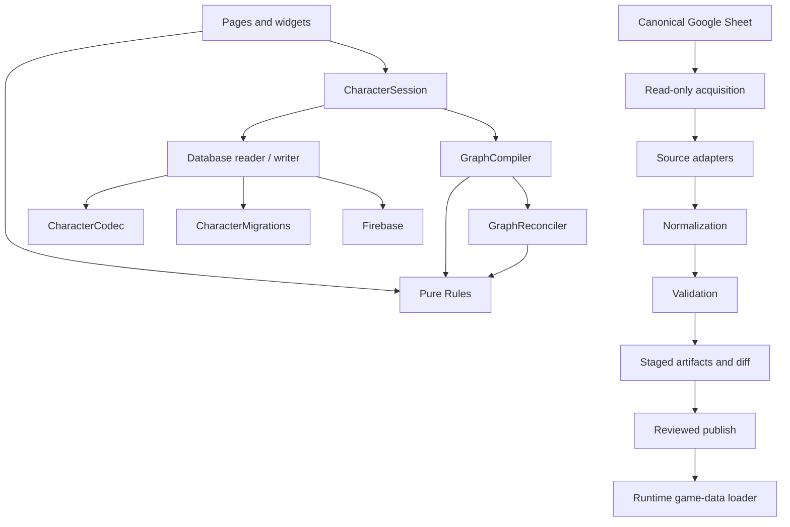

# Architecture

Status: living current-and-target architecture.

Last updated: 2026-08-04.
Execution status and named steps live in [status.md](status.md) and [roadmap.md](roadmap.md).

## Product shape

Game X Character Builder is a static, Firebase-hosted web application:

- Firebase Hosting serves HTML, CSS, browser ES modules, and reviewed generated game-data JSON.
- Firebase Authentication identifies players and optional GMs.
- Firestore stores character documents.
- Cloud Storage stores portraits.
- A native Google Sheet is the editable source for structured rules data; the website never reads the live Sheet at runtime.

The frontend deliberately has no bundler. Browser code under `public/` uses native ES modules. Node-based scripts are development/release tooling only.

## Architectural objective

The builder is moving from page-owned mutable state toward a complete in-memory character session and dependency graph.

The finished architecture must reconstruct the entire character from persisted Firebase data plus unsaved session commands. Every meaningful selection is represented by a graph node that records:

- stable identity and choice type;
- source owner and provenance;
- grants and prerequisites;
- storage binding;
- whether it is persisted, proposed, automatic, derived, incomplete, or invalid.

Edges express ownership, grants, requirements, satisfaction, materialization, and exclusion. Removing or changing a source computes the complete affected closure through those edges rather than through page-specific branches.

## Dependency direction



Forbidden reverse dependencies:

- Rules and graph modules must not import pages, widgets, DOM state, Firebase, or workbook adapters.
- Graph reconciliation must not query live widgets.
- Repositories/codecs/migrations must not depend on builder pages.
- Runtime code must not know Google Sheet column names or repair source prose.
- Source adapters must not write release artifacts.
- Validation must be runnable without publishing.

## Character-state layers

The target `CharacterSession` owns four explicit states:

| State | Meaning |
|---|---|
| Persisted | Canonical character decoded and migrated from Firebase. |
| Working | Persisted state plus previously accepted unsaved commands. |
| Proposed | A clone of working state with the current command applied. |
| Reconciled | Proposed state after graph/rules reach a deterministic fixed point. |

A change follows this lifecycle:

```mermaid
sequenceDiagram
    participant UI as Page or Widget
    participant S as CharacterSession
    participant G as Graph and Rules
    participant U as User
    participant R as Database reader/writer

    UI->>S: typed command
    S->>G: compile and reconcile proposed state
    G-->>S: reconciled state and structured impacts
    alt validation errors
        S-->>UI: reject; errors cannot be confirmed
    else destructive or confirmation-required impacts
        S-->>U: preview affected choices
        U-->>S: confirm or cancel
    end
    S->>S: commit exact reconciled state
    S->>R: canonical versioned patch
```

Cancellation leaves working state and widget display byte-for-byte unchanged. Confirmation commits the exact reconciled state that produced the preview; reconciliation is not rerun against a different state after confirmation.

## Component ownership

### Pages

Pages bootstrap authentication, load the session, collect widgets, submit commands, show structured impacts, and coordinate navigation/save. They do not calculate capacity, prerequisites, or dependent removals.

Current transition modules include `public/js/builder/builder-page.js` and individual builder page coordinators. Some page-local policy remains and is removed domain by domain in later work packages.

### Widgets

Each widget owns display and editing behavior for one choice type. It can produce commands/proposed patches, display values, and local input errors. It cannot be the authority for whether a source/grant exists or mutate persisted state directly.

Adding a new domain such as Boons should require a widget, rules/registry entries, node/grant factories, and tests—not edits to every page controller or traversal function.

### Rules

Rules are pure functions for capacity, expected selection counts, prerequisites, compatibility, and derived values. Widgets use them for display; graph compilation/reconciliation uses the same functions for enforcement.

Current shared modules include `character-rules.js`, `choice-capacity.js`, `choice-identity.js`, and related core helpers. These are transitional and will be consolidated behind typed contracts rather than duplicated in pages.

### GraphCompiler

The compiler converts one complete character state plus normalized game data into typed nodes and edges. Compilation is deterministic and has no UI or persistence side effects.

Representative node types include character facts, sources, grants, option groups, answers, selected feats/techniques, materialized weapons, resources, and validation diagnostics.

Representative edge types:

- `owns`: source to source-owned answer;
- `grants`: source to granted node/capacity;
- `rebinds`: a source-owned overlay to a previously defined choice without replacing its base answer;
- `requires`: selected node to prerequisite;
- `satisfies`: fact/answer to requirement;
- `materializes`: answer to projected runtime object such as a weapon;
- `excludes`: mutually incompatible nodes.

Choice rebinding is layered state, not destructive replacement. The original answer remains owned by its original grant and is validated against that grant. Each active `choice-rebind` source may own a replacement overlay that is validated against the rebind constraints. The highest-precedence active overlay supplies the effective answer; removing it reveals the preceding active overlay or the original answer. Feature progression establishes precedence, so dropping from level 5 to level 4 removes a level-5 overlay without discarding a level-3 overlay or the base choice. Equal-precedence rebinds of the same answer are a contract conflict unless a later roadmap slice defines an explicit order.

The schema-v2 data pipeline preserves typed `rank` and `choice-rebind` grants with an explicit runtime-stub status. Executable overlay storage, widgets, persistence migration, and graph reconciliation belong to their later character-builder vertical slice; Work Package B must not pretend that preservation alone implements the UI behavior.

### GraphReconciler

The reconciler applies removal/prerequisite/capacity policy to the affected graph closure until no further state changes occur. It returns:

- reconciled canonical state;
- structured added/changed/removed/incomplete choices;
- blocking errors;
- confirmation-required impacts;
- informational impacts.

It does not produce UI strings as its primary contract; presentation layers format structured impacts.

### Database reader/writer, CharacterCodec, and CharacterMigrations

The existing `database-reader.js` and `database-writer.js` modules are the two halves of the only normal page-facing character persistence boundary. They are strengthened in place rather than duplicated behind a second repository implementation. The codec supplies exact defaults and rejects malformed or unknown canonical fields. `CharacterMigrations` is the only module allowed to understand historical character formats; it applies the evidence-backed unversioned-to-v1, v1-to-v3, v3-to-v4, and v4-to-v5 edges deterministically. Pages, widgets, rules, graph code, sessions, and canonical persistence logic operate only on v5 and must not contain compatibility branches.

Schema version 5 and the pure codec API are defined in [character-data-contract.md](character-data-contract.md); the compatibility contract is defined in [character-migrations.md](character-migrations.md), and the read/write/revision contract is defined in [character-persistence.md](character-persistence.md). Canonical state excludes Firestore timestamps and revisions and uses stable game-data keys rather than display names. `character-persistence.js` shares Firebase-free envelope, patch-ownership, and revision rules between the reader and writer without becoming a parallel page-facing repository.

The definitive v5 reader/writer APIs are implemented and emulator-tested. Their deployed-page integration remains blocked by the frozen runtime data's missing stable technique keys. Clearly marked v4 exports remain temporarily for existing callers; they are not an approved second architecture and must not spread into graph, Rules, or widget code.

Character-sheet autosave owns only temporary play-state leaves such as current HP, strain, notes, and conditions. Builder-owned identity, class, attributes, skills, abilities, techniques, equipment, and choices are outside its write scope.

## Game-data architecture

The source pipeline has two independent versioned contracts:

- source schema: native workbook schema v4;
- production runtime artifact schema: frozen release schema v1;
- staged runtime artifact schema: schema v2, pending authenticated acceptance and reviewed publish.

The exporter is responsible for an explicit transformation between them. It must not treat workbook rows as runtime objects without adaptation.

Target phases:

1. Acquire the fixed Drive file through read-only authenticated export and capture provenance.
2. Read workbook cells without applying domain meaning.
3. Adapt each tab and source-version alias into a canonical in-memory source model.
4. Normalize expressions/scalars through shared typed registries.
5. Validate headers, enums, identities, ownership, references, and domain invariants.
6. Build deterministic artifacts entirely in memory.
7. Write only a complete staging run plus hashes and semantic diff.
8. Promote the exact reviewed staged bytes in a separate explicit operation.

The canonical workbook's `Metadata`, `Schema`, and `Enums` tabs participate in validation. `ClassSkills` is the normalized mechanical relationship table. Display-workbook compatibility adapters and Handbook formatting are downstream presentation systems, not runtime source contracts.

See [game-data-contract.md](game-data-contract.md) and [data-pipeline.md](data-pipeline.md).

## Firebase trust boundaries

The primary character path is `users/{uid}/characters/{characterId}`. Firestore/Storage Security Rules, not client UI, enforce ownership and GM access. GM status is the `gm` custom claim.

All saves must be sanitized, narrow, visible on failure, and serialized. Broad map writes from stale tabs are prohibited. See [security.md](security.md) and [admin-operations.md](admin-operations.md).

## Current transition state

- Milestone 0 and Work Package A automated safety work are complete; real-browser acceptance remains deployment-blocking.
- Work Package B is active. The production game-data release is frozen and baselined.
- Schema-v4 acquisition, a domain-neutral XLSX reader, canonical per-tab adapters, shared typed expressions, pure whole-model reference/domain validation, deterministic schema-v2 artifact construction, runtime-load acceptance, atomic staging, and structural/semantic diffing are implemented against fixtures. Live end-to-end acceptance is blocked on the repository Drive identity; production remains frozen pending source resolution, diff review, and publish approval.
- The v5 codec, isolated migration registry, and definitive database reader/writer APIs are implemented. Switching deployed pages to the v5 boundary remains blocked on reviewed stable-key runtime data. The complete `CharacterSession` and split compiler/reconciler remain target components.

Exact status and the next named step are in [status.md](status.md).

## Definition of done

The rearchitecture is complete only when:

- Firebase state plus unsaved commands reconstruct one complete in-memory character;
- every selected answer has stable identity, source, grants, prerequisites, and storage binding;
- graph edges determine transitive effects without page-specific branches;
- graph/rules results are deterministic and widget-independent;
- accepted reconciled state is exactly what persistence writes;
- stored character versions migrate deterministically;
- fresh game-data releases are authenticated, validated, reproducible, provenance-stamped, diffed, and accepted by runtime without repair;
- every builder page uses the shared session lifecycle;
- Boons can be added without modifying page controllers or graph traversal;
- tests, documentation, source workbooks, and release artifacts cannot silently drift apart.
