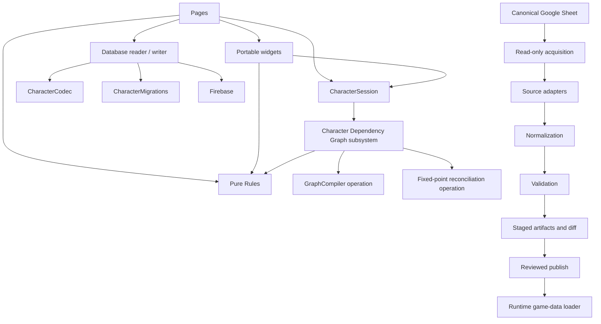

# Architecture

Status: living current-and-target architecture.

Last updated: 2026-09-22.
Execution status and named steps live in [status.md](status.md) and [roadmap.md](roadmap.md).

## Product shape

Game X Character Builder is a static, Firebase-hosted web application:

- Firebase Hosting serves HTML, CSS, browser ES modules, and reviewed generated game-data JSON.
- Firebase Authentication identifies players and optional GMs.
- Firestore stores character documents.
- Cloud Storage stores portraits.
- A native Google Sheet is the editable source for structured rules data; the website never reads the live Sheet at runtime.

The frontend deliberately has no bundler. Browser code under `public/` uses native ES modules. Node-based scripts are development/release tooling only.

## Architectural objective

The builder is moving from page-owned mutable state toward a complete in-memory character session and dependency graph.

The finished architecture must reconstruct the entire character from persisted Firebase data plus unsaved session commands. Every meaningful selection is represented by a graph node that records:

- stable identity and choice type;
- source owner and provenance;
- grants and prerequisites;
- storage binding;
- whether it is persisted, proposed, automatic, derived, incomplete, or invalid.

Edges express ownership, grants, requirements, satisfaction, materialization, and exclusion. Removing or changing a source computes the complete affected closure through those edges rather than through page-specific branches.

## Dependency direction



Forbidden reverse dependencies:

- Rules and graph modules must not import pages, widgets, DOM state, Firebase, or workbook adapters.
- Graph reconciliation must not query live widgets.
- Repositories/codecs/migrations must not depend on builder pages.
- Runtime code must not know Google Sheet column names or repair source prose.
- Source adapters must not write release artifacts.
- Validation must be runnable without publishing.

## Character-state layers

The implemented pure `CharacterSession` owns four explicit states:

| State | Meaning |
|---|---|
| Persisted | Canonical character decoded and migrated from Firebase. |
| Working | Persisted state plus previously accepted unsaved commands. |
| Proposed | A clone of working state with the current command applied. |
| Reconciled | Proposed state after graph/rules reach a deterministic fixed point. |

A change follows this lifecycle:

```mermaid
sequenceDiagram
    participant UI as Page or Widget
    participant S as CharacterSession
    participant G as Graph and Rules
    participant U as User
    participant R as Database reader/writer

    UI->>S: typed command
    S->>G: compile and reconcile proposed state
    G-->>S: reconciled state and structured impacts
    alt validation errors
        S-->>UI: reject; errors cannot be confirmed
    else destructive or confirmation-required impacts
        S-->>U: preview affected choices
        U-->>S: confirm or cancel
    end
    S->>S: commit exact reconciled state
    S-->>UI: exact save snapshot and expected revision
    UI->>R: canonical versioned patch
    R-->>UI: next revision
    UI->>S: acknowledge exact save
```

Cancellation leaves working state and widget display byte-for-byte unchanged. Confirmation commits the exact reconciled state that produced the preview; reconciliation is not rerun against a different state after confirmation.

The session core is implemented in `character-session.js`, with strict direct-intent commands in `character-commands.js` and deterministic canonical diffs in `character-state-diff.js`. It protects every state snapshot from caller mutation, permits only one pending proposal, and uses exact proposal/save identities. The reconciliation function remains injected. Its default is intentionally identity-only, while `createCharacterSessionGraphReconciler` now supplies the implemented graph policy for fixture and later domain integration. See [character-session.md](character-session.md) and [character-graph.md](character-graph.md).

## Component ownership

### Pages

Pages bootstrap authentication, load the session, collect portable widgets, submit commands, show structured impacts, and coordinate navigation/save. A page obtains an exact save snapshot from the session, passes it to the separate database writer, and acknowledges the returned revision. It does not calculate capacity, prerequisites, or dependent removals, and `CharacterSession` never writes Firebase itself.

Pages also own presentation routing for non-blocking save notices. The builder keeps one explicit map from each step to the exact character storage paths editable on that step, and shows only informational impacts within those paths. This is UI ownership metadata, not a second mechanics or dependency policy. It does not consult visit history, and it never filters blocking structural errors or confirmation-required consequences caused by the current proposal.

Current transition modules include `public/js/builder/builder-page.js` and individual builder page coordinators. Some page-local policy remains and is removed domain by domain in later work packages.

### Widgets

Each widget is a portable UI component for one choice type. It owns DOM rendering, accessibility, focus and interaction behavior, current-value display, local input parsing/errors, typed-command production, and presentation of injected structured impacts. State projections, allowed display data, and action callbacks are injected so the same widget can be mounted by another page or shell without importing that page.

A widget does not keep a second mutable character, decide whether a source/grant exists, reconcile dependent choices, or call Firebase/database modules. It may call shared pure Rules to explain or display constraints, but the graph remains the enforcement authority.

Adding a new domain such as Boons requires a widget, rules/registry entries, node/grant factories, and tests—not edits to every page controller or traversal function. The implemented Boon proof registers an automatic `choice | filterType=boon` adapter through graph and grant-widget extension registries; it intentionally does not invent selectable Boon content or a persisted field absent from the canonical contracts.

### Rules

Rules are pure functions for capacity, expected selection counts, prerequisites, compatibility, and derived values. Widgets use them for display; graph compilation/reconciliation uses the same functions for enforcement.

Prerequisites primarily serve as "compile-time" checks on the character build. Here compilation means constructing or revising a character, not compiling JavaScript. Class/level, skill ranks, acquired Traits and tags, selected features, source ownership and applicable equipment requirements determine what the character can select and retain. Relevant build edits cause re-evaluation through the shared Rules and graph. Current Energy, hands, position, triggers and temporary form use describe play-time conditions; they do not remove learned choices or block builder saves. Technique costs and other gameplay mechanics may still be structured for presentation or supported calculations. See [the prerequisite boundary](game-data-contract.md#prerequisites-and-use-conditions).

Rules modules are the sole definition point for game-mechanic formulas, limits, eligibility, capacity, and derived allocation projections. A compiler may turn a Rules result into typed facts and metadata; a reconciler may apply it and produce impacts; a widget may render it and constrain local input. None of those consumers may reproduce the underlying arithmetic, minimum/maximum calculation, ordering policy, or eligibility decision. When several consumers need related values, Rules exposes one frozen projection so those values cannot drift independently. `getAttributeAllocationState` owns the complete attribute calculation; `getSkillAllocationState` and `fitSkillsToRules` own skill progression, granted/free rank floors, paid ranks above those floors, class utility capacity, level rank caps, point usage, assignable minima/maxima, and deterministic repair; `getBondAllocationState` and `fitBondsToRules` own Heart capacity, rank limits, source-owned exclusions, and deterministic Bond repair; `getFeatSelectionState` owns explicit feat-grant slots, filters, maximum feat levels, and deterministic assignment; `selection-rules.js` owns shared selectable/draft/granted-only policy; and `getOriginSelectionState` applies that policy to the Origin projection.

Feat capacity is never inferred directly from character level. A feat choice exists only when an active class, Origin, selected option, feat, or other typed source contains an explicit `feat` grant. Each grant materializes one or more stable graph slots, and each selected feat is assigned to one matching slot. The portable feat widget and graph compiler import the same `feat-rules.js` projection; the page does not calculate slots. Historical `selectedFeats` arrays remain compatible because slot assignment is deterministic in memory and does not invent a second persisted mapping.

Current shared modules include `character-rules.js`, `choice-capacity.js`, `choice-identity.js`, and related core helpers. These are transitional and will be consolidated behind typed contracts rather than duplicated in pages.

`trait-rules.js` owns static Trait acquisition, fixed/skill-based rank, explicit tag grants, source identity and ready Technique access. Its immutable projection is consumed by `trait-graph.js`, the portable Trait widget, both Technique widgets and the character sheet. `prerequisite-rules.js` evaluates typed predicates independently; the `prerequisites.js` facade supplies character Trait context without recursive projection. Schema v6 stores source-owned choices; the earlier activation map is preserved for compatibility but ignored by Rules and widgets. Acquired tags unlock ordinary Technique choices; only explicit granted-only associated Techniques receive automatic access. Costs, timing and form use remain player-tracked prose. Familiar/Mech Trait recipients await their subsystems.

`skill-identity.js` owns the current Ranged Weapons name and its legacy Targeting aliases. This is a game-data naming boundary shared by current v6 state and reviewed older runtime data; it does not interpret historical character document formats. Rules, graph consumers, and widgets import the same helpers instead of maintaining separate alias lists. `getCombatSkillRanks` in Skill Rules combines granted ranks and stored extra combat-skill ranks, so a technique retains the effective rank of an existing Targeting row after its displayed skill becomes Ranged Weapons. Comparison normalization must never be used to rewrite persisted keys: only the exact `targeting` skill key becomes `ranged-weapons`; unrelated keys such as `custom_skill` retain their identity.

### Character Dependency Graph subsystem: compilation

The compiler converts one complete character state plus normalized game data into typed nodes and edges. Compilation is deterministic and has no UI or persistence side effects.

The pure compiler is implemented in `graph-compiler.js`. It accepts exact schema-v6 characters and normalized runtime artifact schema 2 or 3, uses independent node/grant/prerequisite handler registries, and returns sorted frozen plain data. Schema 3 carries explicit source readiness and execution-support diagnostics; unsupported or unfinished records cannot create executable grants. Missing handlers, malformed/dangling identities, conflicting duplicates, dangling edge endpoints, and cycles are blocking structured diagnostics. The migrated fixtures cover every current builder domain, including ordinary/source-owned Bonds and Keystones. `graph-extensions.js` composes isolated new-domain adapters into the same registry without adding traversal branches.

Representative node types include character facts, sources, grants, option groups, answers, selected feats/techniques, materialized weapons, resources, and validation diagnostics.

Representative edge types:

- `owns`: source to source-owned answer;
- `grants`: source to granted node/capacity;
- `rebinds`: a source-owned overlay to a previously defined choice without replacing its base answer;
- `requires`: selected node to prerequisite;
- `satisfies`: fact/answer to requirement;
- `materializes`: answer to projected runtime object such as a weapon;
- `excludes`: mutually incompatible nodes.

Choice rebinding is layered state, not destructive replacement. The original answer remains owned by its original grant and is validated against that grant. Each active `choice-rebind` source may own a replacement overlay that is validated against the rebind constraints. The highest-precedence active overlay supplies the effective answer; removing it reveals the preceding active overlay or the original answer. Feature progression establishes precedence, so dropping from level 5 to level 4 removes a level-5 overlay without discarding a level-3 overlay or the base choice. Equal-precedence rebinds of the same answer are a contract conflict unless a later roadmap slice defines an explicit order.

The schema-v2 data pipeline preserves typed `rank` and `choice-rebind` grants with an explicit runtime-stub status. Executable overlay storage, widgets, persistence migration, and graph reconciliation belong to their later character-builder vertical slice; Work Package B must not pretend that preservation alone implements the UI behavior.

### Character Dependency Graph subsystem: reconciliation

The reconciler applies removal/prerequisite/capacity policy to the affected graph closure until no further state changes occur. It returns:

- reconciled canonical state;
- structured added/changed/removed/incomplete choices;
- blocking errors;
- confirmation-required impacts;
- informational impacts.

It does not produce UI strings as its primary contract; presentation layers format structured impacts.

The bounded fixed-point reconciler is implemented in `graph-reconciler.js`. It applies removal, shared prerequisite, normal-technique capacity, and incomplete-selection policy, recompiles until stable, and returns schema-v6 state plus session-compatible error, confirmation-required, and informational impacts. Non-convergence fails without exposing a partial intermediate character. `graph-core.js` owns the typed graph builder/registry and affected-closure traversal. See [character-graph.md](character-graph.md).

Compilation and reconciliation remain separate pure operations because they answer different questions: compilation describes the current dependency structure, while reconciliation repeatedly asks that compiler what changed after each policy action until the state is stable. They are nevertheless one Character Dependency Graph subsystem, exposed to `CharacterSession` through one reconciliation facade. Pages and widgets do not choose between the two or treat them as independent authorities.

### Database reader/writer, CharacterCodec, and CharacterMigrations

The existing `database-reader.js` and `database-writer.js` modules are the two halves of the only normal page-facing character persistence boundary. They are strengthened in place rather than duplicated behind a second repository implementation. The codec supplies exact defaults and rejects malformed or unknown canonical fields. `CharacterMigrations` is the only module allowed to understand historical character formats; it applies the evidence-backed unversioned-to-v1, v1-to-v3, v3-to-v4, v4-to-v5, and additive v5-to-v6 edges deterministically. Pages, widgets, rules, graph code, sessions, and canonical persistence logic operate only on v6 and must not contain compatibility branches.

Schema version 5 and the pure codec API are defined in [character-data-contract.md](character-data-contract.md); the compatibility contract is defined in [character-migrations.md](character-migrations.md), and the read/write/revision contract is defined in [character-persistence.md](character-persistence.md). Canonical state excludes Firestore timestamps and revisions and uses stable game-data keys rather than display names. `character-persistence.js` shares Firebase-free envelope, patch-ownership, and revision rules between the reader and writer without becoming a parallel page-facing repository.

The definitive v6 reader/writer APIs are implemented and emulator-tested. The reviewed schema-v2 runtime data now supplies stable technique keys; deployed-page integration remains blocked on the affected Work Package E vertical slices and their acceptance. Clearly marked v4 exports remain temporarily for existing callers; they are not an approved second architecture and must not spread into graph, Rules, or widget code.

`CharacterCodec` is the only boundary that validates the complete canonical character shape. Other checks have deliberately narrower jobs: command decoders validate one intent, widgets validate raw local input, pure Rules evaluate game mechanics, graph diagnostics validate dependency structure/meaning, and persistence validates envelopes, paths, and revisions. Those boundaries may call the codec when they require a whole-character guarantee; they must not maintain competing whole-character validators.

Character-sheet autosave owns only temporary play-state leaves such as current HP, strain, notes, and conditions. Builder-owned identity, class, attributes, skills, abilities, techniques, equipment, and choices are outside its write scope.

## Game-data architecture

The source pipeline has two independent versioned contracts:

- source schema: native workbook schema v5 with grant/prerequisite syntax v3; the v4/v2 adapter remains for compatibility;
- production runtime artifact schema: reviewed schema v3, published with the matching builder on September 22;
- staged runtime artifact schema: schema v3 for source v5 and schema v2 for source v4, with deterministic bytes and exact-hash review required for each future publish.

The exporter is responsible for an explicit transformation between them. It must not treat workbook rows as runtime objects without adaptation.

Current v5 authoring declares `Metadata.readinessPolicy=required-cells-v1`. A pure required-cell policy derives completeness and source-located missing-field evidence; authors maintain no readiness/status columns. Optional descriptions, notes, Energy, and pumping never determine completeness. Blank Energy normalizes to zero, while pumping requires explicit `pumpingByRank` entries. Runtime schema 3 retains generated status for existing consumers. The original v5 and v4 adapters remain compatible with earlier snapshots. Prerequisite evaluation, malformed references, and unsupported execution are separate from content completeness. Validation changes must preserve existing selectable/executable content.

Target phases:

1. Acquire the fixed Drive file through read-only authenticated export and capture provenance.
2. Read workbook cells without applying domain meaning.
3. Adapt each tab and source-version alias into a canonical in-memory source model.
4. Normalize expressions/scalars through shared typed registries.
5. Validate headers, enums, identities, ownership, references, and domain invariants.
6. Build deterministic artifacts entirely in memory.
7. Write only a complete staging run plus hashes and semantic diff.
8. Promote the exact reviewed staged bytes in a separate explicit operation.

The canonical workbook's `Metadata`, `Schema`, and `Enums` tabs participate in validation. The v5 adapter derives normalized class-skill relationships from the three distinct Classes fields, preserving roles and primary-attribute conditions. It retains raw authored cells alongside normalized fields and diagnoses unknown or malformed content at its original location. Traits and provider relationships, selection routes and readiness, generic pumping, underlying basic attacks, explicit grant recipients, and reusable feature references survive adaptation and serialization. The shared Rules layer owns contextual selection and executable prerequisite semantics. Conditional feature execution, recipient-owned Artifact skills, and the held Familiar/Mech/class-specific form systems remain deferred and unavailable where their behavior cannot yet execute. Display-workbook compatibility adapters and Handbook formatting are downstream presentation systems, not runtime source contracts.

The stage command normally acquires a fresh read-only Drive export. An explicit snapshot/provenance pair can instead be checked for canonical identity, versions, exact length/hash, and native workbook contract before entering the same pipeline. This mode never borrows connector credentials or claims to restore command-line authentication. September 22 publishes reviewed schema-3 data and the schema-6 builder together. Removed identities have explicit compatibility or player-review dispositions; the loader never guesses replacements from names. Reading an older character does not write its migrated state to Firebase.

While the reviewed runtime artifacts still contain the former skill name, `loadGameXData` applies the pure `projectSkillNames` projection in memory. It updates explicit skill fields, exact skill option labels, and skill-context prose without changing generated artifact bytes or performing a data publish. Unrelated entity keys and explicit choice IDs remain unchanged. Aiming names such as Enhanced Targeting and Targeting Computer, and ordinary targeting prose, retain their meaning. Saved skill and source-owned choice compatibility is defined in [character-persistence.md](character-persistence.md#ranged-weapons-naming-compatibility).

See [game-data-contract.md](game-data-contract.md) and [data-pipeline.md](data-pipeline.md).

## Firebase trust boundaries

The primary character path is `users/{uid}/characters/{characterId}`. Firestore/Storage Security Rules, not client UI, enforce ownership and GM access. GM status is the `gm` custom claim.

All saves must be sanitized, narrow, visible on failure, and serialized. Broad map writes from stale tabs are prohibited. See [security.md](security.md) and [admin-operations.md](admin-operations.md).

## Current transition state

- Milestone 0 and Work Package A automated safety work are complete. The user made deferred personal acceptance nonblocking and explicitly authorized the September 22 release; remaining manual checks are follow-up.
- Reviewed schema-v3 production data is exact-hash baselined. The generic exporter remains frozen and only the reviewed publisher may change production artifacts.
- Schema-v4 acquisition, a domain-neutral XLSX reader, canonical per-tab adapters, shared typed expressions, pure whole-model reference/domain validation, deterministic schema-v2 artifact construction, runtime-load acceptance, atomic staging, structural/semantic diffing, exact-byte publishing, and transactional rollback are implemented and live-accepted.
- The v6 codec, migration registry, definitive reader/writer, CharacterSession and graph reconciliation are deployed with compatible data. Local signed-in save/reload, cancellation, focus and revision-conflict scenarios pass. Retained compatibility helpers and deferred mechanics remain separate Work Package E work.

Exact status and the next named step are in [status.md](status.md).

## Definition of done

The rearchitecture is complete only when:

- Firebase state plus unsaved commands reconstruct one complete in-memory character;
- every selected answer has stable identity, source, grants, prerequisites, and storage binding;
- graph edges determine transitive effects without page-specific branches;
- graph/rules results are deterministic and widget-independent;
- accepted reconciled state is exactly what persistence writes;
- stored character versions migrate deterministically;
- fresh game-data releases are authenticated, validated, reproducible, provenance-stamped, diffed, and accepted by runtime without repair;
- every builder page uses the shared session lifecycle;
- Boons can be added without modifying page controllers or graph traversal;
- tests, documentation, source workbooks, and release artifacts cannot silently drift apart.
